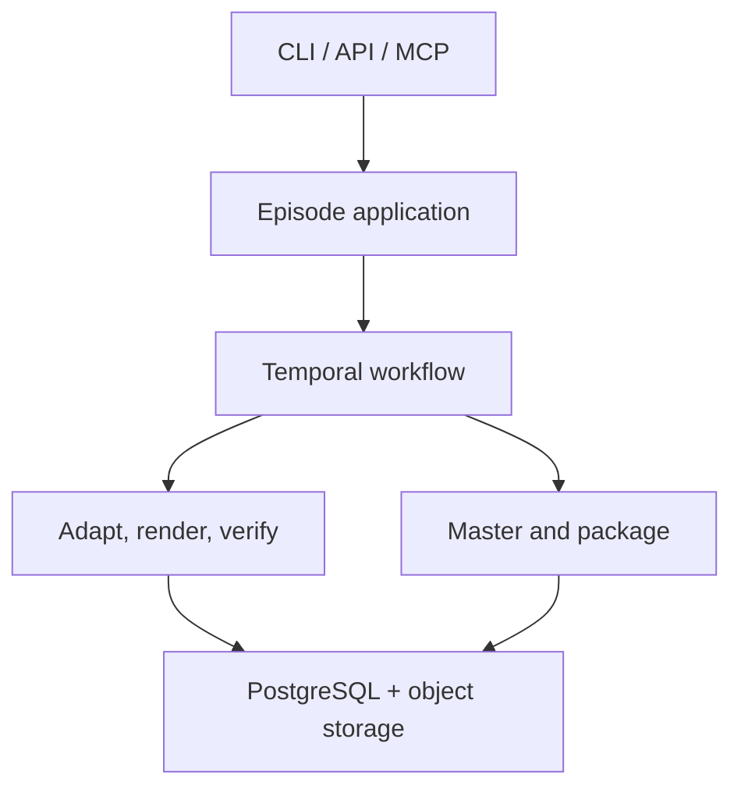

# PodDown Architecture

## Purpose

PodDown converts canonical Markdown into a verified, mastered, publishable podcast
episode package. Signal & Supply is the first client, but no finance-specific
concept is part of the core.

## System boundaries

The initial deployment is a modular monolith plus durable workers. FastAPI owns
the asynchronous API, PostgreSQL stores authoritative metadata, Temporal owns
orchestration state, S3-compatible storage holds immutable artifacts, and ffmpeg
performs deterministic mastering. NATS JetStream emits integration and usage
events; it is not required to reconstruct workflow state.

## Bounded modules

| Module | Responsibility | Explicit boundary |
|---|---|---|
| intake | Parse Markdown/frontmatter and resolve a versioned profile | Produces an immutable source snapshot |
| adaptation | Produce a source-bound treatment and canonical dialogue script | Reasoning provider cannot render audio |
| pronunciation | Resolve layered lexicons and normalize expected speech | Returns a versioned resolution manifest |
| segmentation | Split dialogue at semantic boundaries within provider limits | Provider limits do not leak into API contracts |
| rendering | Request one or more candidates through a `VoiceRenderer` port | Vendor payloads remain adapter-local |
| verification | Transcribe, compare, verify critical tokens, and score audio | Produces machine-readable pass/fail evidence |
| mastering | Stitch accepted candidates and apply deterministic DSP | Never changes script content |
| packaging | Generate audio, transcripts, chapters, notes, QA, and provenance | Package schema is versioned |
| publishing | Publish an immutable package through adapters | Requires explicit authorization |
| metering | Record usage and provider cost events | Never controls correctness |

## External AI provider policy

PodDown owns canonical content, orchestration, rights checks, retries, selection,
QA, metering, and provenance. External AI providers receive the minimum data
needed for one bounded operation. They may render or transcribe; they may not
silently adapt the script, choose publishable output, waive a quality gate, or
become the system of record.

All provider adapters MUST:

- implement PodDown ports and keep vendor request/response types adapter-local;
- declare capabilities such as formats, sample rates, request limits, voice
  controls, model/version pinning, timestamps, and idempotency support;
- use explicit model and voice identifiers, validated timeouts, bounded retry
  classes, rate-limit handling, and circuit-breaking at the activity boundary;
- preserve vendor request IDs, model/voice IDs, normalized usage, estimated and
  reconciled cost, latency, and response checksums in provenance;
- keep API keys in environment-backed secret configuration and redact keys,
  source text, audio, and voice identifiers from logs unless explicitly safe;
- reject rendering before a request when voice rights or tenant scope is invalid;
- map provider failures into stable PodDown error categories; and
- use deterministic adapter tests in CI, with live tests opt-in, separately
  marked, budget-capped, and excluded from untrusted pull requests.

### Reference-demo rendering modes

`poddown-demo --output PATH` selects `local-system-tts-demo`: a host-local
renderer using macOS `say` or Linux `espeak-ng`/`espeak`, normalized and
inspected through `ffmpeg`/`ffprobe`. It has zero provider cost and reads no API
key; absent local tools are a terminal pre-publication failure. Its audio bytes
vary by host engine and voice version. The explicit
`--audio-mode deterministic` selection preserves `deterministic-local-demo` for
offline structural tests. Neither local mode is live-provider evidence.

ElevenLabs remains a separately authorized live adapter requiring
`ELEVENLABS_API_KEY`, approved voice mapping, rights/consent provenance, and
spending authorization; local mode never silently falls back to it.

### ElevenLabs adapter

ElevenLabs is the initial production `VoiceRenderer`. PodDown sends only the
canonical text for a rights-cleared segment plus the selected provider voice,
model, output format, and supported performance controls. The adapter MUST not
use a provider feature that generates or rewrites dialogue. Provider voice IDs
are resolved only from versioned `VoiceAsset` records.

Requests are one candidate take at a time so every take has independent usage,
cost, checksum, and QA. Request limits are handled through declared segmentation
capabilities, never text truncation. Returned audio is decoded and validated
before becoming a candidate.

### OpenAI adapters

OpenAI Audio is the initial fallback `VoiceRenderer`; OpenAI transcription is the
initial `Transcriber`. They remain distinct adapters even when sharing
authentication. Rendering receives the immutable segment contract and may not
rewrite it. Transcription normalizes words, timestamps and confidence when
available, plus usage and cost.

Using one vendor for both operations does not prove correctness. Critical-token
verification remains deterministic against canonical expected-spoken forms, and
selected evals use an alternate transcription path or human-labelled goldens to
detect correlated errors.

### Provider selection and fallback

Profiles express policies and required capabilities, not vendor SDK payloads.
Selection considers capabilities, allowlists, data policy, rights, health, and
cost ceilings. Fallback creates a new candidate and provenance record. It never
weakens rights, critical-token, or audio-quality gates.

## Durable workflow

1. Snapshot and hash source plus resolved profile.
2. Adapt the source into a canonical, versioned script.
3. Resolve pronunciations and extract critical tokens.
4. Segment the script while preserving speaker and factual grouping.
5. Render candidates; use multiple takes for difficult segments.
6. Transcribe and score each candidate.
7. Select a passing candidate or rerender only the failed segment.
8. Stitch and master accepted candidates deterministically.
9. Transcribe and verify the final master.
10. Build and checksum the immutable episode package.
11. Optionally publish through an authorized adapter.

Every activity uses stable idempotency keys derived from episode version, stage,
segment, and attempt. Retries may create candidate records but never duplicate an
episode version or publication.

## Failure semantics

- Validation and rights failures are terminal and occur before paid rendering.
- Transient provider, storage, and network failures retry with bounded backoff.
- Candidate QA failures are expected domain outcomes, not infrastructure errors.
- Exhausted candidate attempts fail the segment and therefore the render job.
- Final-master QA failure prevents packaging and publication.
- Publication is independently retryable and cannot mutate the package.

## Security and tenancy

Tenant ID is required at repository and object-key boundaries. Voice consent is
checked against tenant, project, commercial use, and revocation time before each
render. Secrets are adapter configuration, never profile content. Logs and events
contain stable IDs and costs but exclude source text and credentials by default.

## Initial deployment decision

Keep one Python distribution with independently runnable API and worker processes.
This preserves clear module ports without premature microservices. Split services
only when scaling, isolation, or release cadence provides measured justification.
