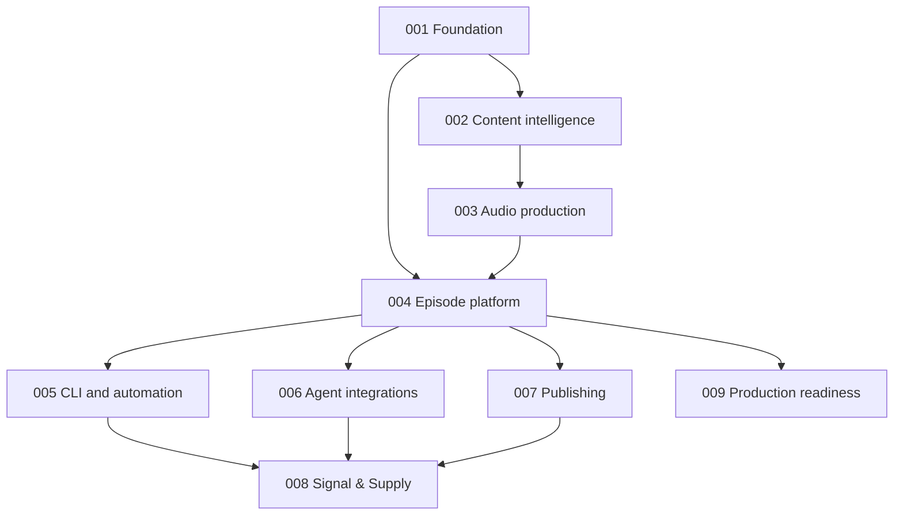

# PodDown Specification Portfolio

This index is the authoritative map from approved product requirements to
implementation-ready specifications. A requirement appears in exactly one owning
specification; other specifications reference it rather than redefining it.

## Portfolio

| Spec | Scope | Original decomposition items | Status |
|---|---|---|---|
| [001](001-core-audio-vertical-slice/spec.md) | Foundation contracts, provider policy, intake and fidelity primitives | 1, 2, 6, 7, 12, 13, 16 | Foundation implemented |
| [002](002-content-intelligence/spec.md) | Source-bound treatment, script, dialogue, pronunciation and segmentation | 4, 5, 8, 9 | Planned |
| [003](003-durable-audio-production/spec.md) | Temporal rendering, takes, repair, audio gates and mastering | 10, 11, 12, 14, 15 | Planned |
| [004](004-episode-platform/spec.md) | Episode model, async API, multitenancy, storage and metering | 3, 22, 23 | Planned |
| [005](005-cli-and-automation/spec.md) | CLI and GitHub Action | 18, 21 | Planned |
| [006](006-agent-integrations/spec.md) | MCP server, PodDown skill and future ChatGPT app boundary | 19, 20 | Planned |
| [007](007-publishing/spec.md) | Publishing adapters, authorization and disclosure | 17 | Planned |
| [008](008-signal-and-supply/spec.md) | Domain-neutral client integration | 24 | Planned |
| [009](009-production-readiness/spec.md) | Deployment, observability, security, retention and release operations | Cross-cutting | Planned |

## Delivery rules

1. Gherkin feature scenarios and pytest-bdd bindings precede production code.
2. Each spec is delivered as a vertical slice with unit, contract, integration,
   eval and listening tests appropriate to its risks.
3. Critical factual-token accuracy remains exactly `1.0` at candidate and final
   master gates.
4. No downstream surface may bypass tenant scope, voice rights, immutable source,
   QA, cost or provenance controls.
5. A slice is complete only when its acceptance evidence is recorded under
   `docs/verification/` and the full non-live suite remains green.

## Dependency order

